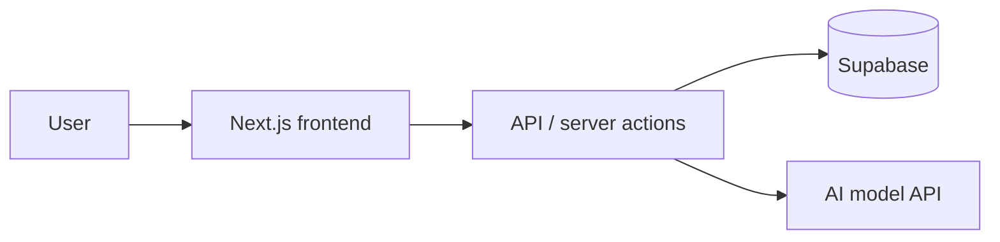

# [Project Name]

<!-- markdownlint-disable MD013 -->

<!--
HOW TO USE THIS TEMPLATE
1. Copy this file to the root of YOUR project and rename it README.md.
2. Replace everything in [square brackets]. Delete any section you can't fill honestly.
3. Delete this comment block.
Judges often open your repo before or during judging. This page is your second pitch: they should
understand the project in 30 seconds without running anything.
Fill it in during the Harden phase (feature freeze), not at the deadline.
-->

> **[One sentence: "<Product> lets <person> <do thing> in <time>."]**
> Built in [N] hours at [Hackathon name, year] for the [track / sponsor prize] track.

**🔗 Live demo:** [https://your-app.vercel.app] · **🎬 Video:** [YouTube link] · **📝 Submission:** [Devpost link]


<!-- A GIF of the "AHA" moment is the single most useful thing on this page. -->

---

## The problem

[2–3 sentences. Who is struggling, with what, and why current options fail. Use a real quote or number if you have one.]

## What it does

1. [The user does X…]
2. […the app does Y…]
3. […and they get Z.]

## Try it in 60 seconds

- Open **[demo URL]**
- Log in with the demo account: `demo@example.com` / `[password]` *(or: no login needed)*
- Click **[button]** and watch **[result]**

## How it works



<!-- Keep the diagram to 4–6 boxes. Edit the Mermaid code above; GitHub renders it automatically. -->

| Part | Tech | Why we chose it |
| --- | --- | --- |
| Frontend | [Next.js + shadcn/ui] | [reason] |
| Backend / data | [Supabase] | [reason] |
| AI | [model name] | [reason] |
| Hosting | [Vercel] | [reason] |

### Sponsor technology used

- **[Sponsor product]:** [exactly what it does in our app, e.g. "transcribes the user's voice note in step 2"]

## What's real and what's mocked

Be honest here. Judges respect it, and some events require it.

| Feature | Status |
| --- | --- |
| [Core feature] | ✅ Working end to end |
| [Login] | 🟡 Hardcoded demo user |
| [Payments] | ⚪ Mocked for the demo |

## How we used AI

[Required by many events. Which AI tools you used and for what. Copy it from your AI-usage log; see `PROMPTS.md` → P4 in the toolkit.]

## Run it locally

```bash
git clone [repo URL]
cd [folder]
npm install
cp .env.example .env.local   # then fill in the keys listed in .env.example
npm run dev                  # open http://localhost:3000
```

## What's next

- [The next feature you'd build]
- [Who you'd test it with]

## Team

| Name | Role | Link |
| --- | --- | --- |
| [Name] | [Frontend / backend / design / pitch] | [GitHub or LinkedIn] |

## License

[MIT](LICENSE) <!-- or remove this section. Check the event rules: some require an open-source license. -->
