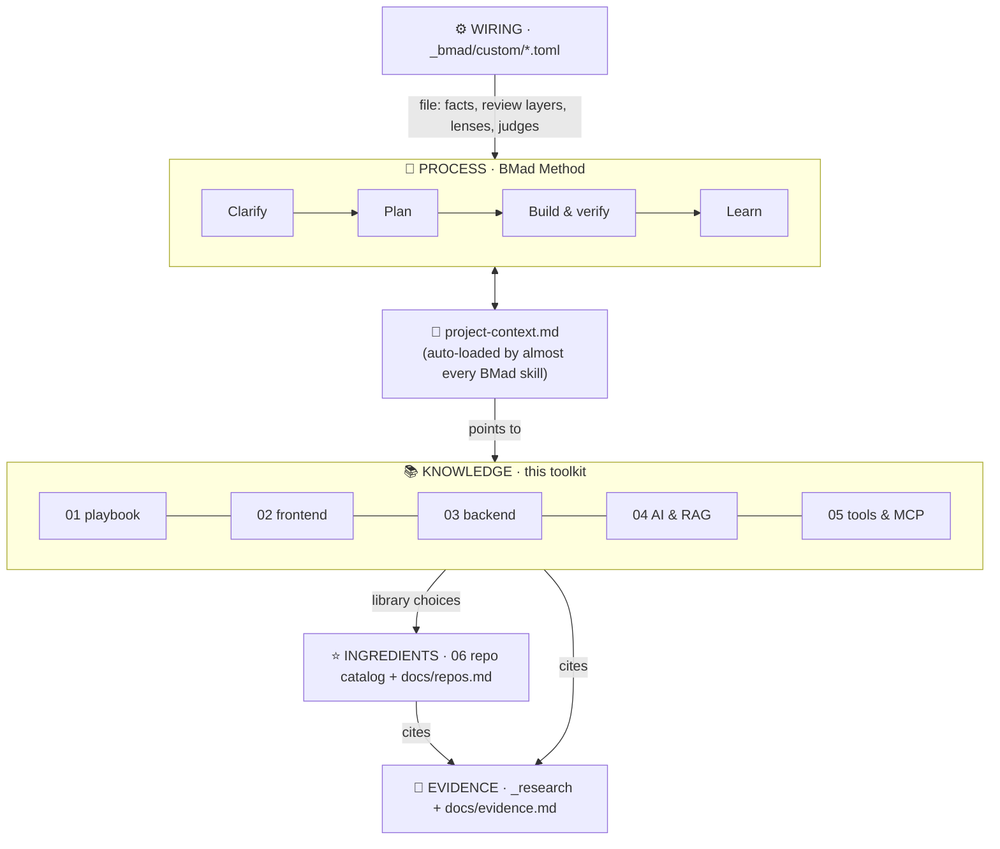
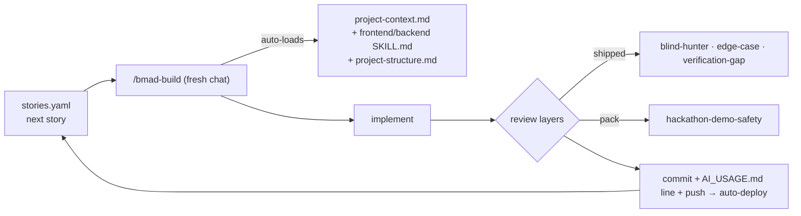

# 🧭 07 · BMad Workflow: How Everything Fits Together

<!-- markdownlint-disable MD013 -->

> 🧠 **The engine room.** This toolkit runs on BMad. The **day-to-day guide** is in folder 01: set up with [`../01-hackathon-playbook/docs/setup-bmad.md`](../01-hackathon-playbook/docs/setup-bmad.md), then follow [`../01-hackathon-playbook/battle-plan.md`](../01-hackathon-playbook/battle-plan.md). **This folder is the reference behind it:** the config pack that setup installs, how the wiring works, and a detailed skill-by-skill map. You only need to read it to customise or troubleshoot.
>
> This guide shows how to run a hackathon with the **BMad Method** as the process and this toolkit as its knowledge base. It covers how the pieces connect, the exact wiring (verified against BMad's config resolver on 2026-09-22), and what happens in each phase, skill by skill and hour by hour.
>
> Companion files: [`bmad-playbook.md`](bmad-playbook.md) is a verdict on every BMad skill, and [`config-pack/`](config-pack/README.md) holds the drop-in wiring.

---

## 1 · The mental model: five layers



| Layer | What it is | Lives in | Who uses it |
| --- | --- | --- | --- |
| **Process** | *When* to do *what*: Clarify → Plan → Build → Learn | BMad skills (`/bmad-*`) | You, driving Claude Code |
| **Hub** | The event facts and hard constraints, plus pointers to the toolkit | `project-context.md` at your repo root | **Almost every BMad skill, automatically** (see §2) |
| **Wiring** | Per-skill overrides that load toolkit files and add review gates | `_bmad/custom/*.toml` | BMad's resolver, at skill activation |
| **Knowledge** | *How* to do each thing well: standards, prompts, templates | `.toolkit/01–05` | BMad skills (via facts) and you (via prompts) |
| **Ingredients** | *What* to build with: verified repos, default kit, avoid list | `.toolkit/06-repo-catalog`, each folder's `docs/repos.md` | Build, architecture, you |
| **Evidence** | *Why* each rule holds: cited sources, freshness | `_research/`, each folder's `docs/evidence.md` | You, when you doubt a rule; Refresh |

**The key idea:** BMad supplies the discipline (fresh sessions, spec before code, review before merge). The toolkit supplies hackathon-specific judgement, such as "Next.js 16 uses `proxy.ts`", "demo working by 0:90", "don't use Lucia". The config pack means you don't have to paste that judgement into every session.

---

## 2 · How the wiring works (verified mechanisms)

Every BMad skill resolves its settings in three layers: `customize.toml` (shipped) → `_bmad/custom/<skill>.toml` (team) → `_bmad/custom/<skill>.user.toml` (personal). **Lists append, and tables keyed by `id`/`code` merge.** The toolkit uses five hooks:

| Hook | Supported by | What the toolkit puts there |
| --- | --- | --- |
| `persistent_facts` (literal text, `file:` globs, `skill:`) | every skill | Cheat sheets (`skills/*/SKILL.md`), standards docs, event rules |
| Default `project-context.md` fact | 15 of the 18 skills used here ship with it (checked 2026-09-22). `bmad-spec` only reads the **repo-root** file. Exceptions: `bmad-cis-storytelling` (the pack adds it) and `bmad-project-context` (it writes AGENTS.md). `bmad-deep-recon` leaves it out **on purpose**, because its research firewall keeps project context out of the evidence | Your filled-in `project-context.md` at the repo root: **one file reaches almost every skill** |
| `review_layers` (`id`, `instruction`, optional `when`) | `bmad-build`, `bmad-build-auto`, `bmad-code-review` | Demo-safety, OWASP API, a11y + CWV, Impeccable detector |
| `lenses` | `bmad-review` | `hackathon-pitch` lens |
| `party_members` / `party_groups` | `bmad-party-mode` | Judges panel (5 personas), build crew |
| `external_sources` | `bmad-project-context`, `bmad-deep-recon`, `bmad-ux`, `bmad-architecture` | Toolkit cheat sheets offered when writing AGENTS.md |

**Verified:** with the pack installed in a test repo, `resolve_customization.py --project-root <repo>` returned party-mode groups `[…, judges-panel, build-crew]`, code-review layers `[blind-hunter, edge-case-hunter, verification-gap, acceptance-auditor, owasp-api, a11y-cwv, anti-slop]` and build layers `[…, hackathon-demo-safety]`.

> [!WARNING]
> **The one way this silently fails:** BMad finds the project root by walking up the folder tree. Your home folder has `C:\Users\braed\_bmad`. If the hackathon repo has no `_bmad/`, every skill uses the home install and **ignores the repo's overrides**. Always run `npx bmad-method install` inside the hackathon repo.

---

## 3 · Setup (days before the event)

| Step | Command / action | Toolkit source |
| --- | --- | --- |
| 1. Accounts and CLIs | Vercel, Supabase, Clerk, model API, Railway if you use Python; `vercel` / `supabase` / `railway` logged in | [`skills/hackathon-deployment`](../skills/hackathon-deployment/SKILL.md) |
| 2. MCP servers | Context7, Supabase (read-only), Playwright, shadcn, 21st; Stitch optional | [`05-tools-and-mcp/docs/mcp-setup.md`](../05-tools-and-mcp/docs/mcp-setup.md) |
| 3. Design skills | `npx impeccable install`; `npx skills add https://github.com/Leonxlnx/taste-skill` | [`02-frontend/docs/impeccable.md`](../02-frontend/docs/impeccable.md), [`taste-skill.md`](../02-frontend/docs/taste-skill.md) |
| 4. Rehearse the wiring on a throwaway repo | `npx bmad-method install` → `bash config-pack/install.sh <repo>` → run the verify command | [`config-pack/`](config-pack/README.md) |
| 5. Dry-run `bmad-loop` (optional) | On a toy repo, so overnight runs aren't new on the night | [`bmad-playbook.md`](bmad-playbook.md) → Phase 3 · Build |

> [!NOTE]
> **Cost:** BMad itself is 🆓 open source, but it runs inside **Claude Code, which is 💳 (Pro $20/month or more) or 💰 (API key)**. There's no free plan. $0 alternatives for the build itself are in [`../05-tools-and-mcp/docs/free-ai-dev-tools.md`](../05-tools-and-mcp/docs/free-ai-dev-tools.md).

At kickoff you only need to create the repo, run `npx bmad-method install` and `install.sh`, then fill in `project-context.md` and `docs/research.md`. That takes about 10 minutes, and it's code-free, so it stays within MLH's no-code-before-the-event rule.

---

## 4 · Phase-by-phase integration

For each phase: the **BMad skill** you run (always in a fresh chat), what it **auto-loads** through the pack, the **toolkit prompts** you can add alongside it, what it **produces**, and **where the repo picks come from**.

### 🔍 Phase 1 · Clarify (≈5% of the clock)

| BMad skill | Auto-loaded by the pack | Pair with (toolkit) | Produces | Repos |
| --- | --- | --- | --- | --- |
| `bmad-brainstorming` | `docs/research.md` + ideation rules | `01/PROMPTS.md` **C1** STRATEGIC_ANALYSIS (sponsor sweet spots, trap projects), **I1** | `brainstorm.html`, 3 ideas scored vs rubric | [`01/docs/repos.md`](../01-hackathon-playbook/docs/repos.md): public-apis, awesome-public-datasets |
| `bmad-deep-recon` (15 min) | `quick` preset, hackathon framing | **C2** PERSONA_BUILDER (validation step) | Cited gap/competitor/API-limit summary | — |
| `bmad-forge-idea` | `docs/research.md` + clock pressure | **I2** pressure-test | `forged-idea.md`, KEEP / RESHAPE / KILL | — |
| `bmad-party-mode --party judges-panel` | Judges personas + rules + rubric | **R1** rubric self-check | Scores, top objection, hardest questions (**memory on**, so it remembers this at pitch time) | — |

Optional: `bmad-prfaq` (customer-first stress test, and the press release becomes your pitch hook) and `bmad-cis-design-thinking` for human-centred themes.

### 📐 Phase 2 · Plan (≈5–8%)

| BMad skill | Auto-loaded | Pair with | Produces | Repos |
| --- | --- | --- | --- | --- |
| **`bmad-spec`** → *"break this into stories"* | Strategy cheat sheet + kernel rules + mock-list + slicing rules | Templates: fold `templates/prd.md` fields into the spec (see §5) | `SPEC.md`, `mock-list.md`, `stories.yaml` with story 1 as the walking skeleton and a cut line | — |
| `bmad-architecture` (teams of 2+) | `project-structure.md` + backend cheat sheet + "quick spine" | `03/PROMPTS.md` **B1**, **B10** (schema + RLS + ERD) | One-page spine: tables, contracts, folder ownership | [`03/docs/repos.md`](../03-backend/docs/repos.md) + the default kit in [`06`](../06-repo-catalog/README.md) |
| `bmad-ux` (if UI is judged) | Frontend cheat sheet + clarity-first + one-aesthetic rule | `02/PROMPTS.md` **F1** design brief, **F2** tokens; Stitch MCP | `DESIGN.md` / `EXPERIENCE.md` → copy the token choices into `docs/design.md` | [`02/docs/repos.md`](../02-frontend/docs/repos.md) |
| `bmad-review` (adversarial + edge-case) | Project context | `bmad-advanced-elicitation` → **pre-mortem** | Spec fixes before any code | — |

Skip `bmad-prd`, `bmad-create-epics-and-stories` and `bmad-sprint-planning` for a single-team hackathon. The spec path reads `stories.yaml` directly ([`bmad-playbook.md`](bmad-playbook.md) → Phase 2 · Plan).

### 🔨 Phase 3 · Build (≈60–65%): the story loop



| Situation | BMad skill | Toolkit that plugs in |
| --- | --- | --- |
| Every story | `bmad-build story <n> from …/stories.yaml` | Auto: cheat sheets and structure. Paste as needed: `03/PROMPTS.md` **B2/B3**, `02/PROMPTS.md` **F3/F4**, `04/PROMPTS-ML.md` **ML4/ML5**, `PROMPTS-RAG.md` **R2–R6** |
| Picking a library mid-story | (inside build) | The pack fact forces a check of [`06`](../06-repo-catalog/README.md) and the folder's `docs/repos.md`, and forbids avoid-list libraries |
| The "wow" UI component | build + MCP | `02/PROMPTS.md` **F5** (21st MCP), **F11** (Taste Skill); React Bits / Magic UI from [`02/docs/repos.md`](../02-frontend/docs/repos.md) |
| AI feature | build | [`04/docs/model-selection.md`](../04-ai-and-rag/docs/model-selection.md) (Sonnet 5 workhorse, no prefill), **B12** (LLM through the backend) |
| Heavy media processing | build | **B13** + [`multimodal-pipelines.md`](../04-ai-and-rag/docs/multimodal-pipelines.md) + Railway runbook |
| Something breaks | `superpowers:systematic-debugging` | [`skills/hackathon-troubleshooting`](../skills/hackathon-troubleshooting/SKILL.md) (loaded by the pack in `bmad-build`) + `03/PROMPTS.md` **B11** (env → runtime → network → DB → limits) |
| Merge conflict or git mistake | — | [`skills/hackathon-git-teamwork`](../skills/hackathon-git-teamwork/SKILL.md) |
| Deploy trouble | — | [`skills/hackathon-deployment`](../skills/hackathon-deployment/SKILL.md) failure tables |
| Midpoint (~50%) | **`bmad-correct-course`** | Pack loads the 50% rule; `01/PROMPTS.md` **M1** |
| Scope argument | `bmad-party-mode --party build-crew` | Demo skeptic vs shipper vs adversary |
| Overnight | **`bmad-build-auto`** via `bmad-loop` (on a branch) | Pack mirrors build facts + the demo-safety gate; morning review with `bmad-checkpoint-preview`; `bmad-loop-resolve` for escalations |
| Agent keeps making the same mistake | **`bmad-project-context`** (record) | Adds a pitfall line; the pack offers the toolkit cheat sheets as sources |

### 🛡️ Phase 4 · Harden (≈10%, feature freeze)

| BMad skill | Pack adds | Pair with | Result |
| --- | --- | --- | --- |
| **`bmad-code-review`** on the demo-critical diff | Layers: **owasp-api** (reads `03/docs/security.md`), **a11y-cwv** (UI diffs; reads `02/docs/standards.md`), **anti-slop** (`npx impeccable detect`) + security doc as a fact | `03/PROMPTS.md` **B6** RLS audit, **B7** OWASP pass, **B9** free-tier guard | Prioritised findings; fix Critical/High only |
| **`bmad-qa-generate-e2e-tests`** | "One Playwright test of the exact demo script" | `02/PROMPTS.md` **F9** responsive check, **F12** deployed slop gate | A deploy gate: if it's red, don't deploy |
| `bmad-checkpoint-preview` | — | `01/PROMPTS.md` **M2** demo hardening | Human walkthrough of what's actually shipping |

### 🎤 Phase 5 · Pitch (≈12–15%)

| BMad skill | Pack adds | Pair with | Result |
| --- | --- | --- | --- |
| `bmad-cis-storytelling` | `pitch-and-demo.md` + 3-minute arc + human-voice rule | `01/PROMPTS.md` **C6** PITCH_GENESIS, **P1** | `docs/pitch/outline.md`, `script.md` |
| `bmad-cis-agent-presentation-master` | (project context) | [`01/docs/repos.md`](../01-hackathon-playbook/docs/repos.md): Slidev, Excalidraw, Mermaid, VHS | 5–7 slides |
| **`bmad-party-mode --party judges-panel`** | Same judges, with **memory** of your hour-1 idea check | **P2** Q&A drill | Scores, the 5 hardest questions, 15-second answers |
| `bmad-review` (**hackathon-pitch** + prose lenses) | Pitch lens | **P3** Devpost write-up, **P4** AI disclosure (from `AI_USAGE.md`) | Tight submission text |

### 📈 Phase 6 · Learn (after)

| BMad skill | Pack adds | Result |
| --- | --- | --- |
| `bmad-retrospective` | Harvest rules: patterns, scaffolding, runbooks, prompts, pitfalls → which `.toolkit/` file to update | Acceptance verdict + a list of toolkit updates |
| `bmad-project-context` (record) | — | Pitfalls promoted into the hub for next time |
| `/bmad-deep-recon` → **Refresh** (monthly) | — | Updated `_research/`; then run `python _research/distribute.py` to refresh every folder's `evidence.md` and `repos.md` |

---

## 5 · Artifact flow: who writes what, who reads it

| Artifact (in your repo) | Written by | Read by |
| --- | --- | --- |
| `project-context.md` | You (template), `bmad-project-context` | **Every BMad skill** (default fact) |
| `docs/research.md` | You at kickoff (+ `bmad-deep-recon` summaries) | brainstorming, forge-idea, party-mode (pack facts), C1–C4 prompts |
| `forged-idea.md` | `bmad-forge-idea` | `bmad-spec` |
| `SPEC.md` + `mock-list.md` + `stories.yaml` | `bmad-spec` | `bmad-build` (one story per session), `bmad-retrospective`, `bmad-qa-generate-e2e-tests` |
| Architecture spine | `bmad-architecture` | `bmad-build` (as an upstream artifact) |
| `DESIGN.md` → `docs/design.md` | `bmad-ux`, `/impeccable init`, Stitch MCP | build (UI stories), code-review anti-slop layer |
| `AI_USAGE.md` | build (pack fact) | P4 disclosure prompt, judges |
| `docs/pitch/*` | storytelling, C6 | review (pitch lens), party-mode judges |

**One source of truth per question.** On the BMad path, **`SPEC.md` replaces `docs/prd.md`**. Use the PRD template as a checklist of what the spec must contain:

| `templates/prd.md` section | Where it goes in BMad |
| --- | --- |
| Why · Persona | SPEC **Why** |
| Core features / AHA | SPEC **Capabilities** (demo-only) |
| Constraints | SPEC **Constraints** |
| Out of scope | SPEC **Non-goals** |
| Mock list | `mock-list.md` companion (pack rule) |
| Success metrics | SPEC **Success signal** |
| Stories + cut line | `stories.yaml` (pack slicing rules) |

`docs/tech-stack.md` and `docs/design.md` stay as they are. BMad has no direct equivalent for tech-stack, and design is fed by `bmad-ux`.

---

## 6 · The 24-hour run sheet (BMad × toolkit)

| Clock | BMad | Toolkit | Repos |
| --- | --- | --- | --- |
| 0:00 | (setup) `install.sh`, fill the hub | `templates/research.md`, rules in `01/docs/rules-and-standards.md` | — |
| 0:15 | `bmad-brainstorming` | C1, I1 | public-apis, datasets |
| 0:45 | `bmad-forge-idea` → `party-mode judges-panel` | I2, R1 | — |
| 1:05 | `bmad-deep-recon` (quick) | C2 | — |
| 1:20 | **`bmad-spec`** → stories | PRD checklist (§5) | — |
| 2:00 | `bmad-architecture` / `bmad-ux` (as needed) | B1, B10 · F1, F2 | default kit |
| 2:30 | **`bmad-build`** story 1 = walking skeleton → deploy | B2, S3 · deployment skill | Next.js, Supabase, shadcn |
| → | `bmad-build` × N (fresh chat each) | F3–F5, F11 · B3, B12 · ML/R macros | per folder `docs/repos.md` |
| ~12:00 | **`bmad-correct-course`** · `bmad-checkpoint-preview` | M1, 50% rule | — |
| Night | `bmad-build-auto` via `bmad-loop` (branch) | Pack demo-safety gate | — |
| ~17:00 | **Freeze** → `bmad-code-review` · `bmad-qa-generate-e2e-tests` | B6, B7, B9 · F9, F12 · M2 | Playwright |
| 19:30 | `bmad-cis-storytelling` → presentation-master → `party-mode judges-panel` → `bmad-review` | C6, P1–P4 | Slidev, Excalidraw, VHS |
| 23:00 | Submit ≥1 h early | Checklist in `pitch-and-demo.md` | — |
| After | `bmad-retrospective` → `bmad-project-context` | Harvest table in `battle-plan.md` | — |

---

## 7 · Team mapping

| Role | Owns (BMad) | Owns (toolkit) |
| --- | --- | --- |
| **Product / pitch lead** | brainstorming, forge-idea, spec, correct-course, storytelling, party-mode | `01-hackathon-playbook/`, `docs/research.md`, the pitch |
| **Frontend builder** | build (UI stories), ux | `02-frontend/`, Stitch/21st/Impeccable |
| **Backend / AI builder** | build (API/AI stories), architecture | `03-backend/`, `04-ai-and-rag/` |
| **Integrator / QA** (team of 4) | code-review, qa-e2e, checkpoint-preview, bmad-loop | deployment skill, `05-tools-and-mcp/` |

Parallel builders: one story per person per fresh session, in separate branches or worktrees. The architecture spine and `project-context.md` are the shared contract.

---

## 8 · Troubleshooting

| Symptom | Cause | Fix |
| --- | --- | --- |
| Judges or extra review layers don't appear | Overrides not picked up: BMad resolved to `~/_bmad` | Install BMad in the repo; check with `resolve_customization.py --project-root .` |
| A skill ignores toolkit rules | The file path in a `file:` fact doesn't exist (for example `.toolkit` missing) | Re-run `install.sh`; paths are relative to the repo root |
| Sessions feel slow or bloated | Too many large `file:` facts | Point to the `SKILL.md` cheat sheets instead of whole doc folders; remove facts a skill doesn't need |
| The spec ignores the mock list or cut line | Old spec written before the pack was installed | Re-run `bmad-spec` "update the spec" (same slug updates in place) |
| Anti-slop layer fails | No Node / Impeccable | Install with `npx impeccable install`, or accept the skip (the layer says so) |
| The toolkit is out of date | Prices, repos and APIs have moved | Refresh the research → `python _research/distribute.py` → delete `.toolkit/` and re-run `install.sh` |

---

## 9 · Quick reference card

```text
SETUP     npx bmad-method install  →  bash .../config-pack/install.sh <repo>  →  fill project-context.md + docs/research.md
CLARIFY   /bmad-brainstorming · /bmad-forge-idea · /bmad-deep-recon · /bmad-party-mode --party judges-panel
PLAN      /bmad-spec → "break this into stories"  (+ /bmad-architecture, /bmad-ux if needed)
BUILD     /bmad-build story N  (fresh chat each)  ·  /bmad-correct-course at 50%  ·  bmad-loop overnight
HARDEN    /bmad-code-review  ·  /bmad-qa-generate-e2e-tests  ·  /bmad-checkpoint-preview
PITCH     /bmad-cis-storytelling · /bmad-party-mode --party judges-panel · /bmad-review (pitch lens)
LEARN     /bmad-retrospective · /bmad-project-context · /bmad-deep-recon Refresh → distribute.py
LOST?     /bmad-help
```
