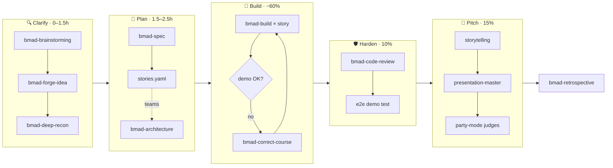

# 🏁 The BMad Hackathon Playbook

<!-- markdownlint-disable MD013 -->

> **Running a hackathon sprint with BMad Method v6.11**, with every installed skill mapped to where it helps and where it doesn't.
>
> 👤 Prepared for **Bread** · 📅 2026-09-21 · 📚 Sources: your installed catalog (`~/_bmad/_config/bmad-help.csv`) and [docs.bmad-method.org](https://docs.bmad-method.org/)

Start here if you want the integration view:

> [!TIP]
> **This is the skill-by-skill verdict guide.** The day-to-day plan is [`../01-hackathon-playbook/battle-plan.md`](../01-hackathon-playbook/battle-plan.md). For how BMad connects to the rest of this toolkit (auto-loaded standards, review layers, the judges panel and the run sheet), start with [`README.md`](README.md) and install the [`config-pack/`](config-pack/README.md).

---

## 📑 Contents

1. [TL;DR](#-tldr)
2. [The mental model](#-the-mental-model)
3. [Pre-event setup](#-pre-event-setup)
4. [The 24-hour timeline](#-the-24-hour-timeline)
5. [Phase 1 · Clarify](#-phase-1--clarify)
6. [Phase 2 · Plan](#-phase-2--plan)
7. [Phase 3 · Build](#-phase-3--build)
8. [Phase 4 · Harden](#-phase-4--harden)
9. [Phase 5 · Pitch](#-phase-5--pitch)
10. [Phase 6 · Learn](#-phase-6--learn)
11. [Team role mapping](#-team-role-mapping)
12. [Game-jam variant](#-game-jam-variant)
13. [Complete skill index](#-complete-skill-index)
14. [Anti-patterns](#-anti-patterns)
15. [Prompt cheat sheet](#-prompt-cheat-sheet)
16. [Your next steps](#-your-next-steps)

---

## ⚡ TL;DR



| ⏱️ When | Phase | Skills |
| --- | --- | --- |
| Days before | Setup | Install BMad in the repo → `bmad-customize` → `bmad-project-context` → build a judges party |
| Hour 0–1.5 | 🔍 Clarify | `bmad-brainstorming` → `bmad-forge-idea` → `bmad-deep-recon` (15 min) |
| Hour 1.5–2.5 | 📐 Plan | `bmad-spec` → *"break this into stories"* → `stories.yaml` (+ `bmad-architecture` for teams) |
| Hour 2.5 → 75% | 🔨 Build | `bmad-build` × one story per **fresh chat** · `bmad-correct-course` at midpoint |
| Overnight | 🌙 Auto | `bmad-build-auto` / `bmad-loop` on a **branch** |
| Last 25% | 🛡️ Harden | Feature freeze → `bmad-code-review` → `bmad-qa-generate-e2e-tests` |
| Last 15% | 🎤 Pitch | `bmad-cis-storytelling` → `presentation-master` → `bmad-party-mode` rehearsal |
| After | 📈 Learn | `bmad-retrospective` |

> [!IMPORTANT]
> **The main rule:** a hackathon project is **epic-sized work**, meaning several Build sessions toward one outcome. BMad's path for that is **Spec → stories.yaml → one `bmad-build` per story → retrospective**. Skip the PRD. Skip sprint-planning. Planning should take about **10%** of the clock, not 40%.

---

## 🧠 The mental model

BMad runs one loop at every scale:

> **Clarify → Plan → Build & verify → Learn & adjust**
>
> *"Bigger work enters it earlier and goes round it more often; it does not become a different way of delivering."* (BMad docs)

A hackathon squeezes that loop into hours. The docs define three sizes of work:

| Work size | BMad path | Where it appears in a hackathon |
| --- | --- | --- |
| **One session** | Intent → `bmad-build` → result | Late fixes, polish, "make the button do X" |
| **Epic-sized** (several builds, one outcome) | `bmad-spec` → `stories.yaml` → `bmad-build` per story → `bmad-retrospective` | ✅ **Your whole hackathon project** |
| **Project-sized** (20+ sessions, many epics, sign-off) | Brief/PRD → UX → Architecture → epics → sprint-planning → build | ❌ Almost never. Only 48h+ with 4+ builders on separate subsystems |

### Why the spec path fits a hackathon

- 🎯 **The 5-field kernel matches the judging rubric.** *Why · Capabilities · Constraints · Non-goals · Success signal* line up with what judges score: problem, solution, feasibility, scope discipline and impact.
- 🚧 **Non-goals protect your scope.** Writing down what you won't build is the best defence against scope creep at hour 3.
- 📏 **Stories are sized for one Build session.** `bmad-build` is designed for about **500 lines changed in a small handful of files**. If a story is bigger, split it.
- 🔎 **Review is built in.** Every Build runs its own multi-reviewer pass and records deferred work, so you get quality checks without a separate QA phase.

---

## 🧰 Pre-event setup

> [!TIP]
> Do all of this **days before** the event, not at hour 0.

### 1 · Fix where BMad writes files

> [!WARNING]
> BMad is currently installed at `C:\Users\braed\_bmad` with `project_name = "braed"`. That makes your **home folder the project root**, so every project's artifacts land in `C:\Users\braed\_bmad-output\`. A `deferred-work.md` and two brainstorms are already in there.

You want everything **inside the hackathon repo**, so it gets committed, shared with teammates, and read by agents.

- ✅ **Recommended:** create the repo and run `npx bmad-method install` inside it. Choose BMM + CIS, and add TEA/GDS only if needed. Artifacts then go to `<repo>/_bmad-output/` and `<repo>/docs/`.
- ⚠️ **Alternative:** override `output_folder` and friends in `_bmad/custom/config.toml`. This is more fragile.

Then run `git init` and make an initial commit. Build, code review, checkpoint and loop all work best with git history.

### 2 · `bmad-customize` `[BC]` · load the hackathon rules into every agent

Add **persistent facts** once, and every BMad skill carries them automatically:

```text
bmad-customize
"Add persistent facts for all workflows:
 - This is a 24h hackathon ending <date/time>. Optimise for a working demo, not production quality.
 - Judging criteria: <paste them, with weights>.
 - Required/bonus tech: <sponsor APIs, prize tracks>.
 - Stack: <e.g. Next.js + Supabase + Claude API>. Do not introduce new frameworks.
 - Deploy target: <Vercel/Render>. Demo is a 3-minute live walkthrough."
```

With these facts loaded, `bmad-spec`, `bmad-build` and every review step push toward the demo instead of gold-plating.

### 3 · `bmad-project-context` `[PC]` · prepare the repo for agents

Run it on the starter repo after you scaffold (for example `create-next-app`). It writes an **AGENTS.md managed block** with verified dev/test/build commands, conventions and pitfalls. Every later Build reads it, so agents stop guessing your package manager.

- 📝 **During the event:** *record mode* turns an agent mistake you've seen into a pitfall line, so it doesn't happen again. Example: *"agent keeps importing from `@/lib/db` instead of `@/server/db`"*.

### 4 · `bmad-party-mode` `[PM]` · build a judges panel ahead of time

Party mode can define **custom personas and AI focus-group panels**. Set one up with these personas:

| Persona | Asks about |
| --- | --- |
| 🧑‍💻 Technical judge | Feasibility, architecture, "is this real or mocked?" |
| 💼 Business judge | Market, "who pays?", differentiation |
| 🏷️ Sponsor judge | "Did you use our API meaningfully?" |
| 🙋 Target user | Whether the product solves their actual pain |

You'll call this panel at **hour 1** (idea check) and **at the end** (pitch rehearsal).

### 5 · BMad Builder (optional, for keen setup)

| Skill | Code | Build this |
| --- | --- | --- |
| `bmad-workflow-builder` | BW | A `hackathon-demo-script` skill (SPEC + stories → timed 3-min script) and a `submission-writer` skill (Devpost write-up) |
| `bmad-agent-builder` | BA | A persistent **"Hackathon Coach"** agent that keeps the clock, the rubric and your non-goals in mind |
| `bmad-agent-builder` / `bmad-workflow-builder` | AA / AW | Quality-analyse what you built |
| `bmad-module-builder` | IM / CM / VM | Bundle it all into a reusable **"hackathon" module**. Worth it after 2–3 events |
| `bmad-eval-runner` | — | Evals for your custom skills. Skip unless you're building modules seriously |

### 6 · Complementary non-BMad skills to have ready

| Skill | Why |
| --- | --- |
| `superpowers:using-git-worktrees` | Parallel builders or agents on separate stories, no conflicts |
| `superpowers:systematic-debugging` | When something breaks at 3 a.m. |
| `frontend-design:frontend-design` | Stops your UI looking like every other hackathon project |
| `claude-api` | Correct model IDs and SDK patterns if you build on Claude |
| `anthropic-skills:pptx` / `slide-deck-builder` | Pitch deck output |

---

## 🕒 The 24-hour timeline

> [!NOTE]
> Scale proportionally: **Clarify 5% · Plan 5–8% · Build 60–65% · Harden 10% · Pitch 12–15%.** For a 48h event, double the *build* block, not the planning block.

| Clock | Phase | Skills | Output | Timebox |
| --- | --- | --- | --- | --- |
| 0:00 | 🚦 Kickoff | Read theme and rules; add them to persistent facts | — | 15 min |
| 0:15 | 🔍 Clarify | `bmad-brainstorming` | brainstorm.html, 3 ideas | 30 min |
| 0:45 | 🔍 Clarify | `bmad-forge-idea` on the top 1–2 | forged-idea.md | 20 min |
| 1:05 | 🔍 Clarify | `bmad-deep-recon` + party-mode judges check | cited summary | 15 min |
| 1:20 | 📐 Plan | `bmad-spec` → *"break this into stories"* | SPEC.md + stories.yaml | 40 min |
| 2:00 | 📐 Plan (teams) | `bmad-architecture` quick spine · `bmad-ux` if UI is judged | ARCHITECTURE-SPINE.md, DESIGN.md | 30 min |
| 2:30 | 🔨 Build | `bmad-build` × N stories (fresh chat each) | working increments | ~14h |
| ~12:00 | 🧭 Checkpoint | `bmad-checkpoint-preview` · `bmad-correct-course` | go / pivot decision | 20 min |
| Night | 🌙 Auto | `bmad-build-auto` / `bmad-loop` | commits on a branch | while sleeping |
| 17:00 | 🛡️ Harden | Freeze → `bmad-code-review` → `bmad-qa-generate-e2e-tests` | demo path locked | 2.5h |
| 19:30 | 🎤 Pitch | storytelling → presentation-master → party-mode → `bmad-review` | deck, script, submission | 3.5h |
| 23:00 | 🧯 Buffer | Deploy, record backup video, submit | — | 1h |
| After | 📈 Learn | `bmad-retrospective` | retro | 30 min |

---

> [!IMPORTANT]
> **Golden rule:** run every skill in a **fresh chat**. The docs warn that reusing a session from another workflow mixes contexts and confuses the run. Artifacts on disk carry the context between sessions; your chat history doesn't.

## 🔍 Phase 1 · Clarify

**Goal:** leave with **one idea you believe in**, pressure-tested, with an evidence check. The most common way to lose a hackathon is picking a mediocre idea and building it well.

### `bmad-brainstorming` · `[BP]`

- **What:** facilitated ideation using one or more creative techniques (SCAMPER, reverse brainstorming, "what if", role-storming, and others).
- **Do:** give it the theme, the sponsor APIs and the judging criteria. Ask for **one technique, 25 minutes, top 3 ideas ranked against the rubric**.
- **Output:** `brainstorm.html` and optionally `intent.md`, which feeds straight into `bmad-spec`.
- **Persona version:** `bmad-cis-agent-brainstorming-coach` (Carson), which is more energetic and conversational. Pick one, not both.

> [!TIP]
> You already have `brainstorm-public-transport-pain-points-2026-08-20/brainstorm.html` in `~/_bmad-output/brainstorming/`. If the theme touches mobility, cities or sustainability, pass that in as a seed and skip half this step.

### `bmad-forge-idea` · `[FI]`

- **What:** persona-driven interrogation, one question at a time, until the idea **hardens, proves out, or dies cheaply**.
- **Do:** run it on your top idea and tell it about the time limit so it presses on feasibility within 24h. Killing a weak idea at hour 1 costs 20 minutes; at hour 14 it costs the hackathon.
- **Output:** `forge-report.html` and `forged-idea.md`. Hand `forged-idea.md` to `bmad-spec`.

### `bmad-deep-recon` · `[RS]`

Decision-grade research. It can draft a prompt for ChatGPT/Perplexity, process a report you bring back, or research directly with web fan-out. **Keep every use under 15 minutes.**

| Type | Hackathon question | Pays off in |
| --- | --- | --- |
| `competitive` | "Has this been built? What's the gap?" | Pitch "why us" line |
| `select` | "Supabase vs Firebase?" / "Whisper vs Deepgram?" | A decision, not a survey |
| `technical` | API limits, rate limits, free tiers | Avoiding a paywall at hour 10 |
| `user-voice` | Real complaints from Reddit or app reviews | Real quotes in the pitch |

**Output:** a cited summary in `planning-artifacts/research/` that `bmad-spec` can consume.

### Other Clarify options (pick at most one)

| Skill | Use when | Verdict |
| --- | --- | --- |
| `bmad-cis-design-thinking` `[DT]` · Maya | Human-centred theme (health, accessibility, education) | ✅ Compress to empathise → define (20 min) |
| `bmad-cis-problem-solving` `[PS]` · Dr. Quinn | Hard technical or "wicked" problem theme | ✅ Root-cause framing |
| `bmad-cis-innovation-strategy` `[IS]` · Victor | VC judges or a "most viable startup" prize | ✅ Business-model angle, 15 min |
| `bmad-prfaq` `[WB]` | You want a customer-first stress test **and** a pitch narrative | ⭐ The press release becomes your pitch opener. Use `-H` for speed |
| `bmad-product-brief` `[CB]` | Idea is fixed and you only want it written down | ❌ Redundant with forge-idea + spec |
| `bmad-agent-analyst` · Mary | You'd rather talk it through with a persona | ✅ Front door to the above |

### 🧑‍⚖️ Judges check (5–10 min)

Run `bmad-party-mode` with your panel: *"Here's our forged idea. Each judge, give your score out of 10 and your single biggest objection."* Then fix the top objection in the spec.

---

## 📐 Phase 2 · Plan

### ⭐ `bmad-spec` · `[SPC]`: the one required planning step

Distils any input (forged idea, brainstorm, research, a voice-dump ramble) into **SPEC.md**, the five-field kernel plus companions. It locks the *what* before the *how*.

```text
bmad-spec _bmad-output/forge/forged-idea.md _bmad-output/planning-artifacts/research/<summary>.md
```

**How to fill each field for a hackathon:**

| Field | Hackathon guidance |
| --- | --- |
| **Why** | One sentence a judge can repeat. This becomes your pitch hook |
| **Capabilities** | Only what appears in the 3-minute demo. If it isn't in the demo, it's a non-goal |
| **Constraints** | Deadline, stack, required sponsor API, "must run live on venue Wi-Fi" |
| **Non-goals** | Auth (hardcoded demo user), payments, admin panels, mobile (unless judged), multi-tenancy |
| **Success signal** | "A judge can do X end-to-end in under 60 seconds" |

Then, in the same session, say **"break this into stories"**. You get an ordered `stories.yaml`.

**Story slicing rules:**

1. 🦴 **Story 1 is a walking skeleton**: deployed, end-to-end, hardcoded data. You have a demo URL by hour 4.
2. 🎬 **Order by demo value**, not technical layering. The wow feature comes early.
3. 📏 **Each story ≤ ~500 LOC**, the Build sizing limit.
4. ✂️ **Mark a cut line.** Everything below it is a stretch goal.
5. 👥 **For teams:** stories that touch disjoint files can run in parallel.

> [!CAUTION]
> Spec input has a practical ceiling of about **40 pages or a few tens of thousands of tokens**. Summarise raw research first, or information gets lost without any warning. Use *"validate this spec"* for a 5-minute sanity check before building.

### `bmad-architecture` · `[CA]` (conditional)

- **Worth it when:** **2+ people build in parallel**, or there's an integration boundary (frontend ↔ API ↔ ML service).
- **What:** a lean **spine of invariants** (data model, API contracts, folder ownership, naming, state ownership) that keeps separately built parts consistent. It prevents merge disasters at hour 16.
- **Do:** ask for a **quick spine**: 20 minutes, one page. Commit it before anyone writes feature code.
- **Solo?** Skip it. SPEC + AGENTS.md is enough.
- **Persona version:** `bmad-agent-architect` (Winston).

### `bmad-ux` · `[CU]` (conditional)

- **When:** UI/UX is a judging criterion, or the product is visual.
- **Output:** `DESIGN.md` (visual system) and `EXPERIENCE.md` (journeys). Keep it to **one demo journey** plus colour and type.
- **Pair with:** `frontend-design:frontend-design` during build, and `figma:figma-generate-design` if you design in Figma.
- **Persona version:** `bmad-agent-ux-designer` (Sally).

### Stress-test the plan (10 min total)

| Skill | Run it as |
| --- | --- |
| `bmad-review` `[RV]` | **Adversarial** + **edge-case** lenses on SPEC.md: *"What breaks in a live demo?"* |
| `bmad-advanced-elicitation` `[AE]` | **Pre-mortem**: *"It's hour 23 and the demo failed. Why?"* Each answer (rate limits, venue Wi-Fi, cold starts, slow LLM calls) becomes a constraint or a mitigation story |

### What to skip in Plan

| Skill | Why skip |
| --- | --- |
| `bmad-prd` `[PRD]` | For when "more than one person must agree on what the product is" at an organisational level. Your team agrees by talking |
| `bmad-create-epics-and-stories` `[CE]` | The PRD-path equivalent. Spec → "break into stories" replaces it |
| `bmad-sprint-planning` `[SP]` | Epics path only. On the spec path, Build reads `stories.yaml` with "no sprint-status dependency between stories" |

---

## 🔨 Phase 3 · Build

### ⭐ `bmad-build` · `[BD]`: your main tool

One full loop per invocation: **clarify → plan → implement → multi-reviewer review → triage → present**.

```text
bmad-build story 1 from _bmad-output/specs/spec-<slug>/stories.yaml
```

It also accepts a sentence, an issue or a ramble: *`bmad-build the map markers don't cluster when zoomed out`*.

**Your three checkpoints (they take seconds, don't skip them):**

| # | Checkpoint | What to check |
| --- | --- | --- |
| 1 | 💬 Intent clarification | Answer carefully. It searches the repo first, so if it asks, it really needs to know |
| 2 | 📋 Plan approval | It reports *intent gaps, irreversible actions, footprint*. **12 files? The story is too big, so split it** |
| 3 | ✅ Result review | Does it match what you wanted? Then commit |

- 🗂️ **Deferred work:** unrelated problems go to `deferred-work.md` instead of derailing the story. In a hackathon, **that file is your "after the demo" list**. Leave most of it alone.
- 🔁 **Rhythm:** one story → commit → push → auto-deploy → next story in a **fresh chat**. The demo URL should never be broken for long.
- 🧑‍💻 **Persona version:** `bmad-agent-dev` (Amelia), for talking through implementation.

### 👥 Team parallelism

- Each builder takes a story on their own branch or worktree (`superpowers:using-git-worktrees`) and runs their own fresh `bmad-build`.
- The **architecture spine is the contract**. If a build needs to change it, stop and agree on it as a team.
- **Merge every story**, not at hour 18.

### 🌙 `bmad-build-auto` + `bmad-loop`: build while you sleep

| Piece | Role |
| --- | --- |
| `bmad-build-auto` | Implements and reviews **one unit unattended**, with no human checkpoints |
| **bmad-loop** (installed module) | Orchestrator. Processes `stories.yaml` **in list order**. It's a linear scheduler with no dependency graph, so order stories correctly |
| `bmad-loop-resolve` | If a run pauses on a **CRITICAL escalation**, run `/bmad-loop-resolve <story-key>` in the morning, clarify the spec, and the loop re-drives the story |
| `bmad-loop-sweep` | Automation-only. The loop calls it to triage the deferred-work ledger |

**Overnight pattern:**

- 🌙 Before sleeping, queue the **low-risk, well-specified** stories: CRUD screens, seed data, settings, README. Keep the wow feature for when you're awake.
- 🌿 **Always use a separate branch.** In the morning, review with `bmad-checkpoint-preview` and merge what's good.
- 🧪 Do a dry run on a toy repo **before** the event. Run commands are in the [bmad-loop repo](https://github.com/bmad-code-org/bmad-loop).

### 🧭 `bmad-correct-course` · `[CC]`: the pivot button

- **When:** a core API doesn't work, the idea isn't landing, or you're behind at the midpoint.
- **What:** assesses the change and recommends what to redo: spec, story slicing, or architecture. It writes a change proposal.
- **Do:** schedule a check at **~50% of the clock**: *"We have 11h and 7 stories left. What do we cut?"*

### 👀 `bmad-checkpoint-preview` · `[CK]`: human review

A guided walkthrough of a change, from purpose down to details. Use it for **overnight loop branches**, **teammate PRs before merge**, and the **midpoint "where are we really" check**.

### 🐛 Debugging

`superpowers:systematic-debugging` is for bugs with a non-obvious cause, so `bmad-build` isn't left guessing. For UI bugs, `claude-in-chrome` can screenshot and read the console.

---

## 🔒 Phase 4 · Harden

> [!WARNING]
> **Declare a feature freeze.** From here on, only fix things that affect the demo path.

### ⭐ `bmad-code-review` · `[CR]`

- **What:** adversarial review with parallel layers and structured triage, on top of Build's built-in review.
- **Do:** run it **once** on the demo-critical diff. Focus: *"anything that could crash or hang in a live demo, and committed secrets."*
- 🔑 **Make sure no API keys are committed.** Judges do look at repos.
- **Pair with:** `superpowers:receiving-code-review`, so you triage the findings instead of fixing everything.

### ⭐ `bmad-qa-generate-e2e-tests` · `[QA]`

Generate **one Playwright test of the exact demo script**. Run it before every deploy after the freeze. **If it goes red, don't deploy.** This is the cheapest insurance you can buy.

Optional: `bmad-review` with the **verification-gap** lens (*"Is the demo path adequately tested?"*).

### 🧪 Test Architecture Enterprise (TEA): mostly skip

| Skill | Code | Verdict |
| --- | --- | --- |
| `bmad-tea` · Murat | — | ❌ Unless code quality is judged. Then have a 10-min chat about which one or two tests matter most |
| `bmad-testarch-framework` | TF | ⏸ Pre-event only, for a test scaffold in the starter repo |
| `bmad-testarch-ci` | CI | ⏸ Pre-event only: a GitHub Action for build + E2E. Impresses technical judges |
| `bmad-testarch-test-design` | TD | ❌ |
| `bmad-testarch-atdd` | AT | ❌ Red-phase TDD scaffolds are too slow for a hackathon |
| `bmad-testarch-automate` | TA | ❌ `bmad-qa-generate-e2e-tests` covers it |
| `bmad-testarch-test-review` | RV | ❌ |
| `bmad-testarch-nfr` | NR | ✅ Only for a performance, security or accessibility prize, as evidence for the pitch |
| `bmad-testarch-trace` | TR | ❌ |
| `bmad-teach-me-testing` | TMT | ⏸ Learn between hackathons |

---

## 🎤 Phase 5 · Pitch

> [!TIP]
> Many teams under-invest here. A great demo with a weak pitch usually loses to a decent demo with a great pitch.

### ⭐ `bmad-cis-storytelling` · `[ST]` · Sophia

Builds a narrative using proven frameworks (Hero's Journey, Pixar spine, Problem–Agitate–Solve). Feed it **SPEC.md** (*Why* → hook, *Success signal* → climax), deep-recon user quotes, and your PRFAQ if you made one.

**The 3-minute arc to ask for:**

| Segment | Time | Content |
| --- | --- | --- |
| 🪝 Hook | 15s | The *Why* in one line |
| 😣 Problem | 30s | A real user quote from user-voice recon |
| 🖥️ Live demo | 90s | The success-signal journey |
| ⚙️ How it works | 30s | Tech and sponsor API usage |
| 🚀 Impact | 15s | What's next |

### ⭐ `bmad-cis-agent-presentation-master` · Caravaggio

Turns the narrative into **5–7 slides**: one idea per slide, big visuals, demo in the middle. Render with `anthropic-skills:pptx`, `slide-deck-builder`, or Canva/Figma slides.

### 🔁 Rehearse and polish

| Skill | Use |
| --- | --- |
| `bmad-party-mode` | Judges panel: *"Score against the rubric, then each ask your hardest Q&A question."* Run it twice and prepare answers for the top 5 |
| `bmad-review` | **Prose** lens (removes filler and generic AI phrasing) and **structure** lens (cuts and reorders) on the submission and slide text |
| `bmad-advanced-elicitation` | **Red team**: *"You're a sceptical judge who's seen 40 pitches today. What makes you tune out?"* |

### ✅ Submission checklist

- [ ] Demo URL live and tested on a **different network** (phone hotspot)
- [ ] **Backup video** of the demo recorded, for when Wi-Fi fails
- [ ] Seed or demo data loaded, demo account logged in
- [ ] README with a screenshot, setup steps and tech stack
- [ ] Sponsor API usage visible and called out (prize tracks)
- [ ] Submission form filled out **1 hour early**

---

## 📈 Phase 6 · Learn

### `bmad-retrospective` · `[ER]`

An evidence-based retro. It reads the full `stories.yaml`, checks the combined result against the parent spec, and gives an acceptance verdict. Supports `-H` for a headless summary.

**Capture the next day:**

- ⏳ Which stories took 3× their estimate, and why
- 🤖 What agents got wrong → add it as a `bmad-project-context` pitfall
- 🧱 What to pre-build next time → add it to your BMB hackathon module

---

## 👥 Team role mapping

| Team | Roles | BMad split |
| --- | --- | --- |
| 🧍 **Solo** | You do everything | Spec → build loop. `bmad-build-auto` overnight acts as a second developer. Skip architecture |
| 👥 **2** | A: backend/integration · B: frontend + pitch | Clarify together. A owns the spec, B owns UX. Parallel builds after the spine. B moves to the pitch at 80% |
| 👥 **3** | + Product/pitch lead | Lead runs Clarify, spec, party-mode, recon and all Pitch skills. Two builders work in parallel worktrees |
| 👥 **4** | + Integrator/QA | Integrator owns the spine, merges, checkpoint-preview, code-review, the E2E test and deployment |

> [!NOTE]
> The **product/pitch lead** should own `bmad-correct-course` calls. Someone needs to watch the clock, and it shouldn't be the person deep in a bug.

---

## 🎮 Game-jam variant

For **game jams** (Global Game Jam, Ludum Dare, Godot/Unity jams), use the **Game Dev Studio** (`gds-*`) skills instead of the BMM planning skills.

| Phase | Skill | Jam use |
| --- | --- | --- |
| 🔍 Clarify | `gds-brainstorm-game` `[BG]` | Theme → 3 concepts using game-specific techniques |
| 🔍 Clarify | `gds-agent-game-designer` / `gds-agent-game-solo-dev` | Conversational partners. ⭐ **Solo dev is ideal for solo jammers** |
| 📐 Plan | `gds-create-game-brief` `[GB]` | 1-page vision: core loop, pillars, fantasy |
| 📐 Plan | `gds-gdd` `[GDD]` | **Tiny**: core mechanic, 1 level, win/lose |
| 📐 Plan | `gds-ux` `[CU]` | HUD and input scheme only |
| 📐 Plan | `gds-create-narrative` `[ND]` | Story-driven games only |
| 📐 Plan | `gds-game-architecture` `[GA]` | Quick: scenes, state, engine choice |
| 📐 Plan | `gds-create-epics-and-stories` → `gds-check-implementation-readiness` → `gds-sprint-planning` | Classic story flow; keep it to ~6–10 stories |
| 🔨 Build | `gds-create-story` → `gds-dev-story` → `gds-code-review` | Per story. Or ⭐ **`gds-quick-dev` `[QD]`**, which is faster for most jam work |
| 🔨 Build | `gds-investigate` `[IN]` | Forensic hunt for physics or state bugs |
| 🔨 Build | `gds-sprint-status` `[SS]` / `gds-correct-course` `[CC]` | Midpoint check and scope cuts |
| 🛡️ Harden | `gds-playtest-plan` `[PP]` | ⭐ A 15-min structured playtest with other jammers at 70% |
| 🛡️ Harden | `gds-performance-test` `[PT]` | Web builds with frame-rate issues only |
| 🎤 Pitch | `gds-agent-tech-writer` | Itch.io page and game description |
| 📈 Learn | `gds-retrospective` | Post-jam |
| ❌ Skip | `gds-test-framework` · `gds-test-design` · `gds-test-automate` · `gds-e2e-scaffold` · `gds-test-review` · `gds-domain-research` · `gds-prd` · `gds-document-project` · `gds-generate-project-context` | Too heavy for a jam |

---

## 📚 Complete skill index

**Legend:** ⭐ core to hackathon · ✅ use when it applies · ⏸ pre/post event · ❌ skip · 🔁 deprecated

### BMad Method (BMM)

| Skill | Code | | Hackathon role |
| --- | --- | :-: | --- |
| `bmad-spec` | SPC | ⭐ | **The** planning artifact + `stories.yaml` |
| `bmad-build` | BD | ⭐ | Every story, fresh chat |
| `bmad-brainstorming` | BP | ⭐ | Hour-0 ideation |
| `bmad-code-review` | CR | ⭐ | One pass at feature freeze |
| `bmad-qa-generate-e2e-tests` | QA | ⭐ | One E2E test of the demo script |
| `bmad-correct-course` | CC | ⭐ | Midpoint scope cut / pivot |
| `bmad-project-context` | PC | ⏸ | Pre-event AGENTS.md; record pitfalls live |
| `bmad-build-auto` | — | ✅ | Overnight unattended builds via bmad-loop |
| `bmad-architecture` | CA | ✅ | Teams of 2+: quick spine = contract between builders |
| `bmad-ux` | CU | ✅ | When UI is judged; single demo journey |
| `bmad-prfaq` | WB | ✅ | Customer-first stress test that doubles as pitch narrative |
| `bmad-checkpoint-preview` | CK | ✅ | Teammate PRs, overnight branches |
| `bmad-retrospective` | ER | ⏸ | Day after |
| `bmad-product-brief` | CB | ❌ | Redundant with forge-idea + spec |
| `bmad-prd` | PRD | ❌ | Only 48h+, 4+ people, multiple epics |
| `bmad-create-epics-and-stories` | CE | ❌ | Replaced by spec → "break into stories" |
| `bmad-sprint-planning` | SP / SS | ❌ | Epics path only |
| Mary · John · Winston · Sally · Amelia | — | ✅ | Persona front doors to the workflows above |

### Core

| Skill | Code | | Hackathon role |
| --- | --- | :-: | --- |
| `bmad-forge-idea` | FI | ⭐ | Kill weak ideas at hour 1 |
| `bmad-party-mode` | PM | ⭐ | Judges panel: idea check + pitch rehearsal |
| `bmad-customize` | BC | ⏸ | Persistent hackathon facts (deadline, rubric, stack) |
| `bmad-deep-recon` | RS | ✅ | 15-min competitive / select / API-limit check |
| `bmad-advanced-elicitation` | AE | ✅ | Pre-mortem on spec; red team on pitch |
| `bmad-review` | RV | ✅ | Adversarial on spec; prose/structure on submission |
| `bmad-help` | BH | ✅ | "What next?" whenever you're lost |

### Creative Intelligence Suite (CIS)

| Skill | Code | | Hackathon role |
| --- | --- | :-: | --- |
| `bmad-cis-storytelling` · Sophia | ST | ⭐ | Pitch narrative |
| `bmad-cis-agent-presentation-master` · Caravaggio | — | ⭐ | Pitch deck |
| `bmad-cis-agent-brainstorming-coach` · Carson | — | ✅ | Alternative to `bmad-brainstorming` |
| `bmad-cis-design-thinking` · Maya | DT | ✅ | Human-centred themes |
| `bmad-cis-problem-solving` · Dr. Quinn | PS | ✅ | Hard-problem themes; stuck on a design problem |
| `bmad-cis-innovation-strategy` · Victor | IS | ✅ | Startup / VC-judged tracks |

### BMad Builder (BMB)

| Skill | | Hackathon role |
| --- | :-: | --- |
| `bmad-workflow-builder` | ⏸ | Custom demo-script / submission-writer skills |
| `bmad-agent-builder` | ⏸ | Custom "Hackathon Coach" agent |
| `bmad-module-builder` | ⏸ | Package a reusable hackathon module |
| `bmad-eval-runner` | ⏸ | Test your custom skills |
| `bmad-bmb-setup` | ⏸ | Module install/config |

### BMAD Loop

| Skill | | Hackathon role |
| --- | :-: | --- |
| `bmad-loop-setup` | ⏸ | Configure before the event; dry run on a toy repo |
| `bmad-loop-resolve` | ✅ | Morning fix for CRITICAL escalations |
| `bmad-loop-sweep` | — | Automation-only, invoked by the loop |

### Test Architecture Enterprise (TEA) and Game Dev Studio (GDS)

For TEA, see the [Harden](#-phase-4--harden) table: skip everything during the event except the optional pre-event framework/CI and NFR for a relevant prize. For GDS, see the [Game-jam variant](#-game-jam-variant).

### 🔁 Deprecated: use the replacement

| Deprecated | Use instead |
| --- | --- |
| `bmad-create-prd` · `bmad-edit-prd` · `bmad-validate-prd` | `bmad-prd` (create / update / validate) |
| `bmad-create-architecture` | `bmad-architecture` |
| `bmad-create-story` · `bmad-dev-story` · `bmad-quick-dev` | `bmad-build` |
| `bmad-dev-auto` | `bmad-build-auto` |
| `bmad-document-project` · `bmad-generate-project-context` | `bmad-project-context` |
| `bmad-domain-research` · `bmad-market-research` · `bmad-technical-research` | `bmad-deep-recon <type>` |
| `bmad-editorial-review*` · `bmad-review-adversarial-general` · `bmad-review-edge-case-hunter` · `bmad-review-verification-gap` | `bmad-review` (choose lenses) |
| `bmad-sprint-status` | `bmad-sprint-planning` (status view) |

---

## 🚫 Anti-patterns

| # | Anti-pattern | Instead |
| --- | --- | --- |
| 1 | Running the full enterprise path (5+ hours before any code) | Spec path |
| 2 | One long chat for everything | A fresh chat per skill; artifacts carry state |
| 3 | Stories too big (plan footprint 10+ files) | Split the story |
| 4 | bmad-loop unattended on `main` | A branch + checkpoint-preview |
| 5 | Fixing everything in `deferred-work.md` | Treat it as the after-demo backlog |
| 6 | Skipping Build checkpoints to save time | The 30-second plan approval saves 30 minutes |
| 7 | No walking skeleton | Deployed end-to-end by hour 4 |
| 8 | Leaving the pitch to the last hour | Start at 80% with a dedicated owner |
| 9 | Adding new tech mid-event | Persistent facts forbid it, so let the agents enforce that |
| 10 | Not rehearsing Q&A | Party-mode judges give you the hard questions first |

---

## 📋 Prompt cheat sheet

```text
# ── Hour 0 · Brainstorm ─────────────────────────────────────────
bmad-brainstorming
"Theme: <theme>. Sponsors: <APIs>. Judging: <rubric>. 24h, team of <n>, stack <stack>.
 One technique, 25 minutes. End with top 3 ideas scored against the rubric."

# ── Hour 0:45 · Forge ───────────────────────────────────────────
bmad-forge-idea
"Pressure-test idea #1 from <brainstorm path>. We have 22 hours to a live demo. Be brutal on feasibility."

# ── Hour 1:05 · Recon ───────────────────────────────────────────
bmad-deep-recon competitive
"Quick pass (≤15 min): who has built <idea>? What gap can we claim in one sentence?"

# ── Hour 1:20 · Spec ────────────────────────────────────────────
bmad-spec <forged-idea.md> <research summary>
"Hackathon spec. Capabilities = only what's in a 3-minute demo. Aggressive non-goals.
 Success signal = a judge completes <core action> in under 60s."
→ "break this into stories. Story 1 = deployed walking skeleton. Order by demo value. Mark a cut line."

# ── Hour 2 · Architecture (teams) ───────────────────────────────
bmad-architecture
"Quick spine only, one page: data model, API contracts, folder ownership per builder."

# ── Every story (fresh chat) ────────────────────────────────────
bmad-build story <n> from <spec folder>/stories.yaml

# ── Midpoint ────────────────────────────────────────────────────
bmad-correct-course
"<X>h left, stories <list> remaining, <problem>. What do we cut to protect the demo?"

# ── Freeze ──────────────────────────────────────────────────────
bmad-code-review "Focus: anything that could crash/hang in a live demo, and committed secrets."
bmad-qa-generate-e2e-tests "One Playwright test that performs the exact demo script."

# ── Pitch ───────────────────────────────────────────────────────
bmad-cis-storytelling "3-minute pitch from SPEC.md: hook 15s, problem+user quote 30s, demo 90s, tech 30s, impact 15s."
bmad-party-mode "Judges panel: score this pitch against the rubric, then each ask your hardest question."
bmad-review <submission.md> "prose and structure lenses"

# ── After ───────────────────────────────────────────────────────
bmad-retrospective
```

---

## 🎯 Your next steps

- [ ] **Now:** run the BMad installer inside a hackathon starter repo (see [Pre-event setup](#1--fix-where-bmad-writes-files))
- [ ] **This week:** `bmad-customize` with your standard hackathon facts, then build the party-mode judges panel
- [ ] **Before the event:** dry-run `bmad-loop` on a toy repo so overnight builds aren't new on the night
- [ ] **Optional:** `bmad-workflow-builder` → a `hackathon-demo-script` skill, later bundled with `bmad-module-builder`
