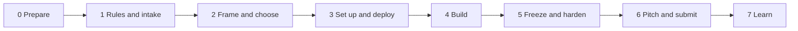

# 🔁 The Workflow: One Path for Both Tracks

<!-- markdownlint-disable MD013 -->

> The single map of the whole event. Each phase has an **exit check**: do not move on until it passes. This page only routes you; the detail lives in the linked pages (nothing is repeated here). Hour marks are for a 24-hour event; for 48 hours, double the Build phase, not the planning.

| # | Phase | When | Software hackathon | Datathon / ML track | Exit check |
| - | --- | --- | --- | --- | --- |
| 0 | **Prepare** | Days before | [`setup-your-laptop.md`](01-hackathon-playbook/docs/setup-your-laptop.md) · [`setup-bmad.md`](01-hackathon-playbook/docs/setup-bmad.md) · [`free-credits.md`](01-hackathon-playbook/docs/free-credits.md) | Python 3.12 + install smoke test: [`tooling-2026-update.md`](08-datathon-handbook/03-modeling/tooling-2026-update.md) · [`quickstart-1-click.py`](08-datathon-handbook/00-start-here/quickstart-1-click.py) | Everyone can run hello-world; accounts and keys exist |
| 1 | **Rules and intake** | H+0 to 0:30 | [`rules-hardware-a11y-remote.md`](01-hackathon-playbook/docs/rules-hardware-a11y-remote.md) | [`judging-and-winning-evidence.md`](08-datathon-handbook/01-playbook/judging-and-winning-evidence.md) (intake checklist) | Criteria, submission format, AI and data rules written into the project context |
| 2 | **Frame and choose** | H+0:30 to 2:30 | [`problem-selection.md`](01-hackathon-playbook/templates/problem-selection.md) · [`prd.md`](01-hackathon-playbook/templates/prd.md) | [`hypothesis-and-problem-framing.md`](08-datathon-handbook/01-playbook/hypothesis-and-problem-framing.md) · runbook Gate 1 | One-sentence problem, named user or decision, explicit non-goals |
| 3 | **Set up and deploy** | H+2:30 to 4 | [`project-structure.md`](01-hackathon-playbook/docs/project-structure.md) · [`git-for-teams.md`](01-hackathon-playbook/docs/git-for-teams.md) · [`deploy-step-by-step.md`](03-backend/docs/deploy-step-by-step.md) | [`PROJECT_TEMPLATE/`](08-datathon-handbook/PROJECT_TEMPLATE/README.md) · runbook Gates 2-3 (locked folds, data audit) | Live URL (software) or frozen folds + audit (datathon); teammate verified it |
| 4 | **Build** | H+4 to ~17 | [`battle-plan.md`](01-hackathon-playbook/battle-plan.md) build loop · [`02-frontend/`](02-frontend/README.md) · [`03-backend/`](03-backend/README.md) · [`04-ai-and-rag/`](04-ai-and-rag/README.md) | Runbook Gates 4-6: baseline, features, improve; pick methods with [`method-selection-guide.md`](08-datathon-handbook/03-modeling/method-selection-guide.md) | Core flow works end to end (software) · OOF score beats baseline each rung (datathon) |
| 5 | **Freeze and harden** | ~H+17 to 20 | [`mvp-and-demo-checklist.md`](01-hackathon-playbook/templates/mvp-and-demo-checklist.md) | Runbook Gate 7 (UI) · pre-submission checklist in the runbook · [`DT19`](08-datathon-handbook/08-ai-agent-kit/PROMPTS.md) | No new features; seeded data; backup video recorded |
| 6 | **Pitch and submit** | H+20 to 23 | [`pitch-and-demo.md`](01-hackathon-playbook/docs/pitch-and-demo.md) · [`project-readme.md`](01-hackathon-playbook/templates/project-readme.md) | [`pitch-and-presentation-guide.md`](08-datathon-handbook/01-playbook/pitch-and-presentation-guide.md) · [`executive-report-template.md`](08-datathon-handbook/01-playbook/executive-report-template.md) | Timed rehearsal under the limit; submission validated against the format; every claim has evidence |
| 7 | **Learn** | After | [`after-the-event.md`](01-hackathon-playbook/docs/after-the-event.md) | Same, plus update `feature_log.csv` lessons | Retro written; follow-ups captured |

## Who does what

| Role | Software hackathon | Datathon |
| --- | --- | --- |
| Lead / framer | PRD, scope cuts, submission owner | Framing, hypothesis tree, $ translation, pitch |
| Builder(s) | Front end, back end | Data engineer and ML modeler |
| UI / demo owner | Deploy, demo, backup video | Streamlit app, SHAP and what-if |
| Everyone | Review each other's PRs; keep an AI-use log | Run the leakage checks; keep an AI-use log |

Detailed role matrices: [`battle-plan.md`](01-hackathon-playbook/battle-plan.md) (software) · [`datathon-battle-plan.md`](08-datathon-handbook/01-playbook/datathon-battle-plan.md) (datathon).

## Rules of the workflow

1. **Rules first.** Phase 1 happens before any code; it decides what you may use and what you must disclose.
2. **Deploy or lock early.** A live URL (software) or frozen folds (datathon) is the first deliverable, not the last.
3. **One source of truth.** Software teams keep the PRD; datathon teams keep `PROJECT_CONTEXT.md`. Everything else links to it.
4. **Evidence for every claim.** If a number cannot be reproduced with one command, it is cut from the pitch.
5. **Freeze means freeze.** After phase 5, fix bugs only.
6. **Do not duplicate.** Add a link to the existing page rather than a second copy (CI checks for identical files).
